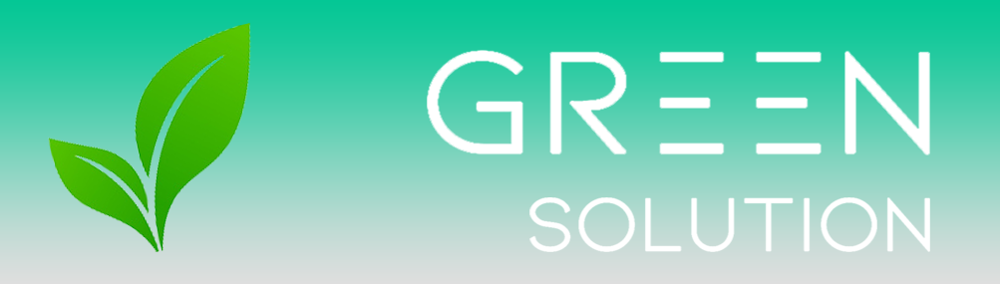
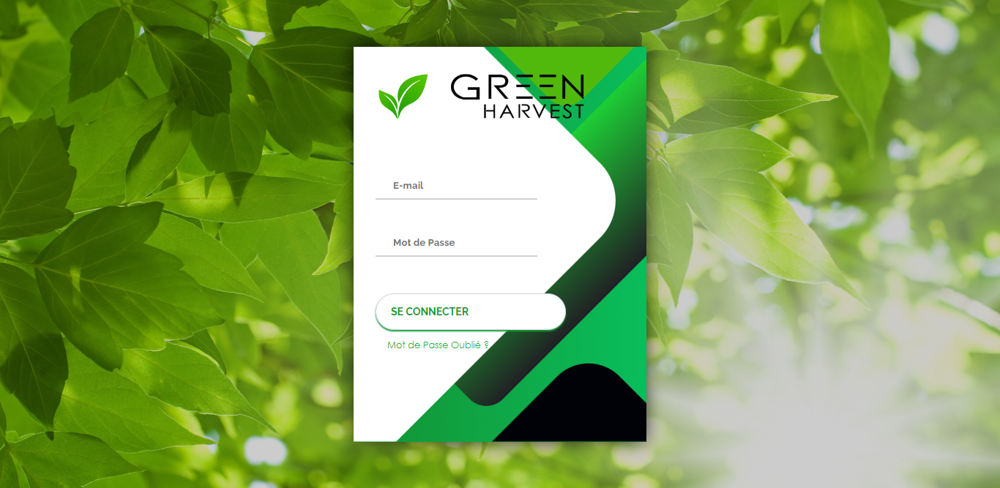
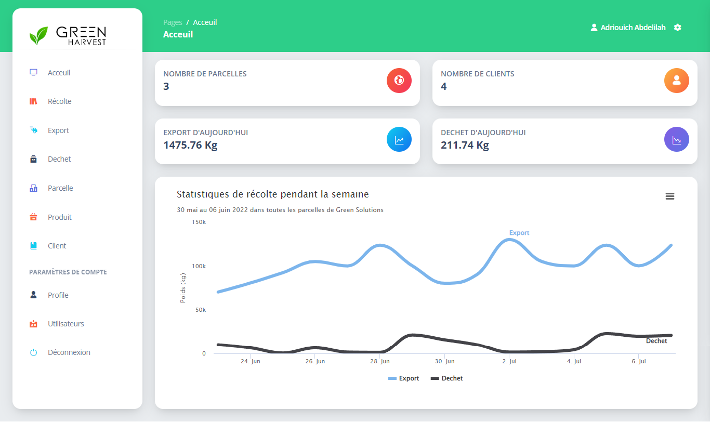
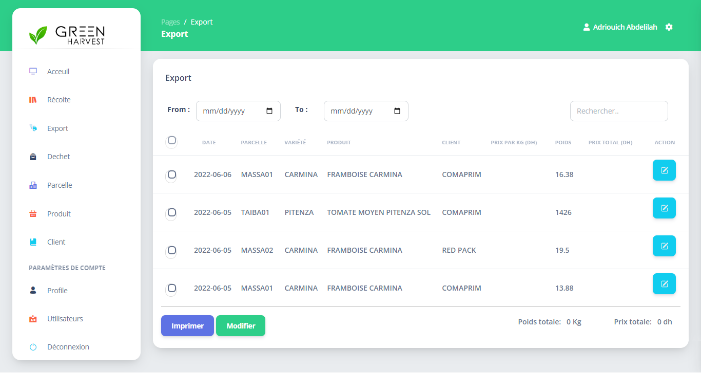
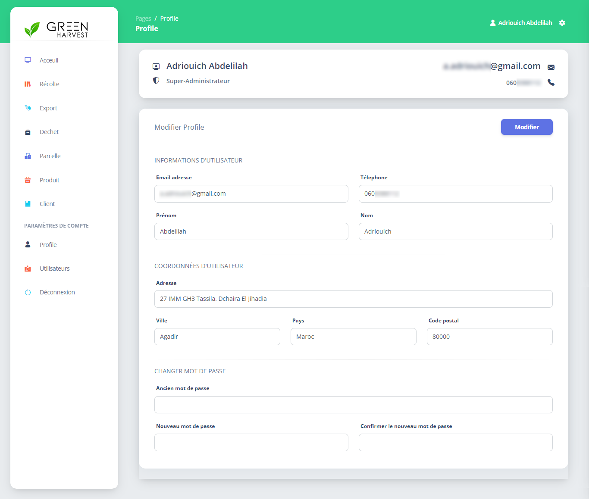
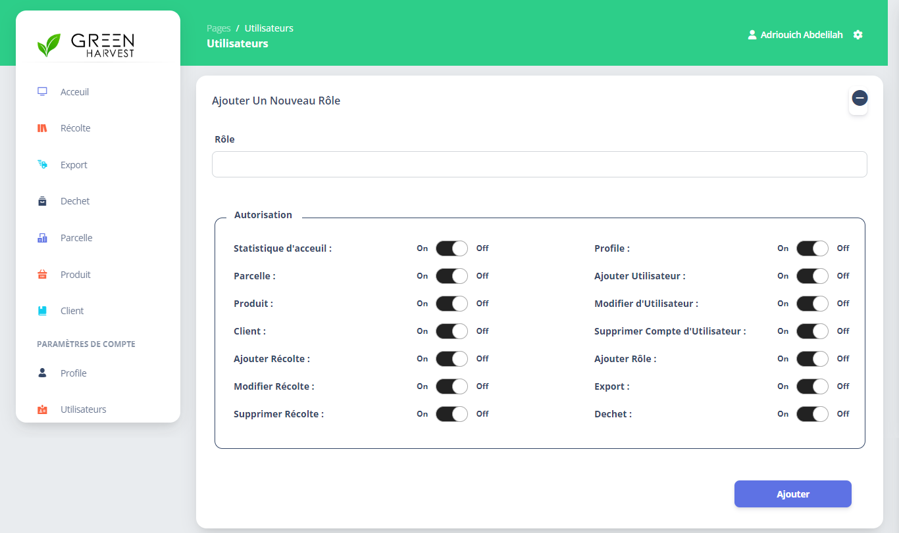
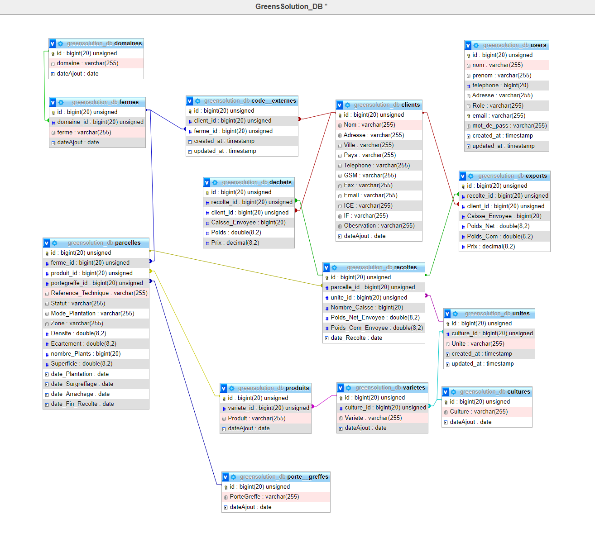

# Green Harvest

This repository documents the culmination of my final internship project at the Higher School of Technology of Agadir (EST), undertaken at Green Solutions, Agadir. The internship, spanning from April 15, 2022, to June 07, 2022, focused on the design and realization of a Harvest Management Application named "Green Harvest."

## Project Summary
"Green Harvest" aims to streamline the daily harvest management process for Green Solutions by transitioning from traditional, manual methods to an efficient web-based application. The project encompassed three main phases: requirement gathering, design and conception, and implementation.

### General Description
The application, "Green Harvest," facilitates the seamless management of daily harvest data, optimizing operations for Green Solutions. By leveraging web technologies and adopting a user-centric approach, the application simplifies data entry, tracking, and analysis.

#### Problematic and Proposed Solution
The conventional method of managing harvest data via manual record-keeping proved inefficient and prone to errors for Green Solutions. "Green Harvest" addresses this challenge by providing an online platform for real-time data recording and analysis, thereby enhancing productivity and accuracy.

### Objectives
The primary objectives of "Green Harvest" include:
- Designing and developing a user-friendly web application for efficient harvest management.
- Enabling role-based access control to ensure secure and tailored user experiences.
- Facilitating data visualization and analysis to track statistics, revenues, and crop waste.
- Ensuring quick adoption and usability for all staff members involved in the harvesting process.

### User Characteristics
The target users of "Green Harvest" include company administrators and staff members directly involved in the harvest management process. Users are expected to have a basic understanding of computer systems to utilize the application effectively.

### Scope
The scope of "Green Harvest" encompasses:
- User registration and role assignment by the super-administrator.
- Management of farms, greenhouses, products, and client information.
- Recording daily harvest data and tracking income from exported production.
- Presentation of statistics through tables and charts.

### Requirements Specification
The functional and non-functional requirements of "Green Harvest" are outlined to ensure the application's effectiveness, usability, and security. Functional requirements include user registration, data management, and reporting functionalities, while non-functional requirements focus on performance, usability, security, portability, and maintainability.

## Screenshots

### Sign In Page

### Home Page

### Export Management Page

### Profile Settings

### Managing User's Roles

## Database Schema

### Database Model

The database schema for "Green Harvest" is designed to efficiently manage and organize harvest-related data. This relational model ensures data integrity and facilitates smooth operations within the application.

## Conclusion
While this repository documents the journey from project inception to application delivery, it also acknowledges that the work presented is not without room for improvement. Despite any imperfections, it highlights the key phases, challenges, and outcomes encountered during the internship period. Moving forward, this documentation serves as a valuable resource for reflection and learning.
